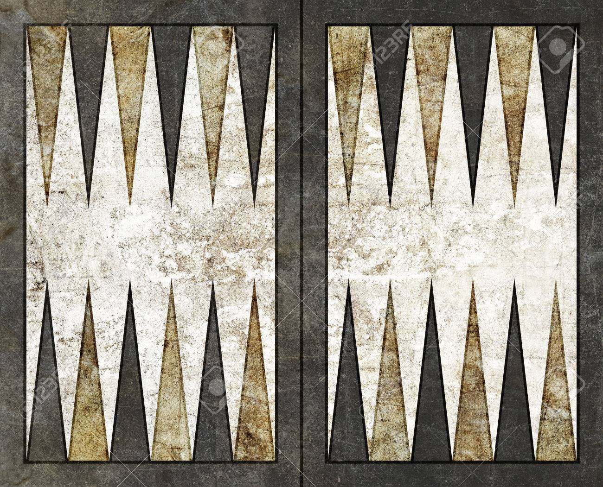

# Backgammon

https://ac123770.github.io/Backgammon/

The goal of this game is to bear off your 15 pieces before your opponent does.
Backgammon is not controlled by a dominating authority, yet the "rules of play" are agreed by the international tournaments.

Backgammon playing pieces may be termed checkers, draughts, stones, men, counters, pawns, discs, pips, chips, or nips.

The objective is for players to remove (bear off) all their checkers from the board before their opponent can do the same. As the playing time for each individual game is short, it is often played in matches where victory is awarded to the first player to reach a certain number of points.

MOVING THE PIECES:
To start the game, each player rolls one die, and the player with the higher number moves first using the numbers shown on both dice. If the players roll the same number, they must roll again. Both dice must land completely flat on the right-hand side of the game board. The players then take alternate turns, rolling two dice at the beginning of each turn.

Once both dice are rolled, the players must, move their checkers according to the number shown on each die. If the player rolls, for example, a 6 and a 3 (ie "6-3"), the player moves one piece six points, another or the same checker three points. The same checker may be moved twice, provided both moves can be made separately and legally: six then three, or three then six. If you roll two of the same number, called doubles, that player must play each die twice. For example, a roll of 5-5 allows the player to make four moves of five spaces each. On any roll, a player must move according to the numbers on both dice if it is at all possible to do so. If one or both numbers do not allow a legal move, the player forfeits that portion of the roll and his or her turn ends. If moves can be made according to either one die or the other, but not both, the higher number must be used. If one die is unable to be moved, but such a move is made possible by the moving of the other die, that move is compulsory.

 

